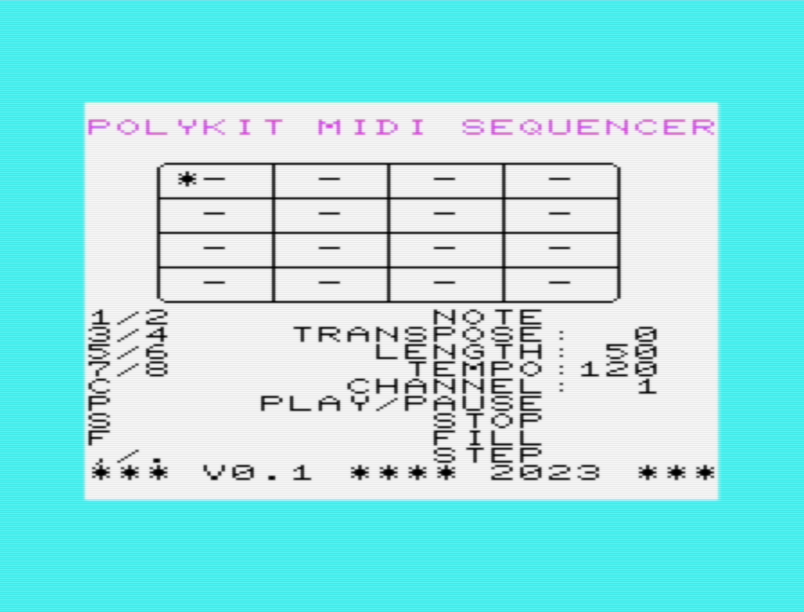

# VIC-20 MIDI SEQUENCER

This is a simple 16-step MIDI sequencer written in BASIC for the Commodore VIC-20. It is using
the VIC-20 MIDI cartridge from RETRO Innovations.

[There is a short demo video over on YouTube](https://www.youtube.com/watch?v=cCfxLhu_GRw)



## Installation

Copy the file `vicseq.prg` over to your favorite device to get data onto the VIC-20, eg. SD2IEC or Pi1541 floppy disk drive emulator. A memory expansion needs to be in place in order for the program to run.

Start it with the following commands:

```
LOAD"VICSEQ.PRG",8
RUN
```

Replace the device number accordingly.

## References

http://www.go4retro.com/products/vicmidi

https://github.com/LeifBloomquist/VICMIDI

https://vice-emu.sourceforge.io

https://cbm-pi1541.firebaseapp.com/
